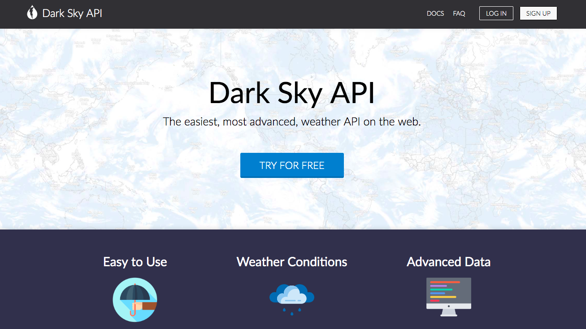
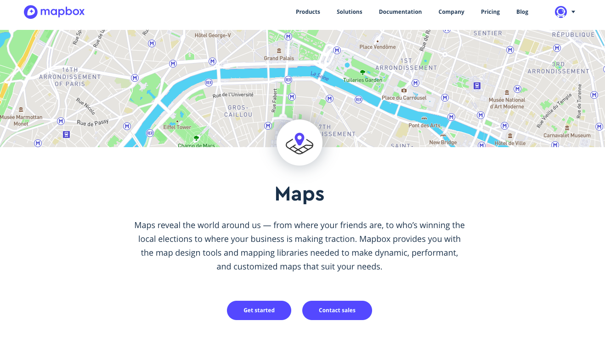
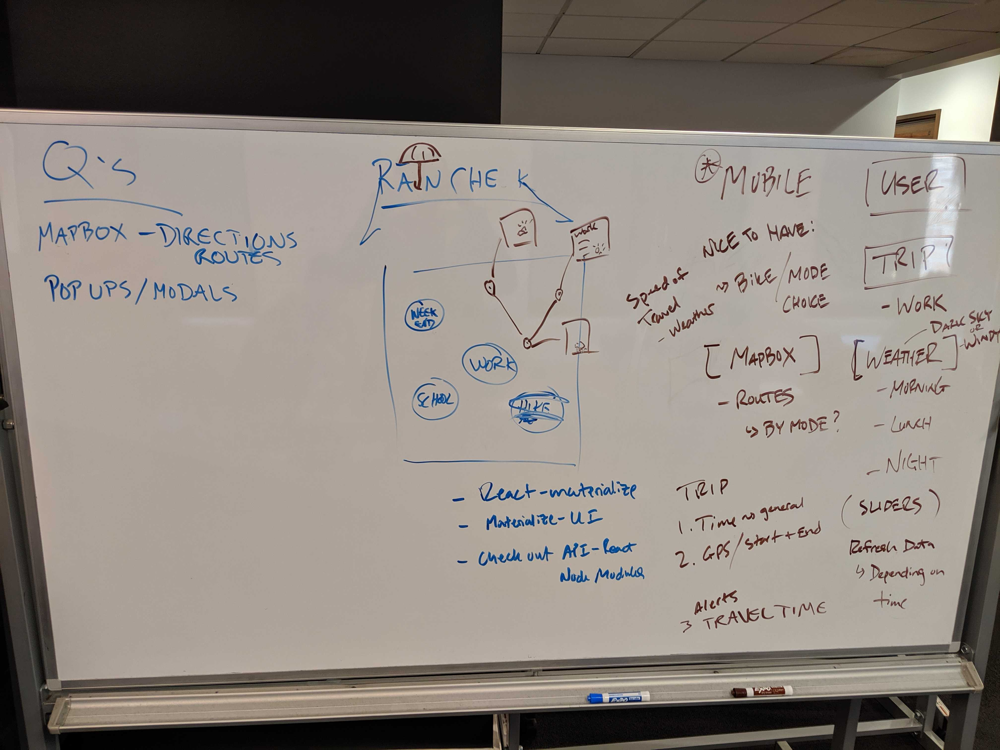
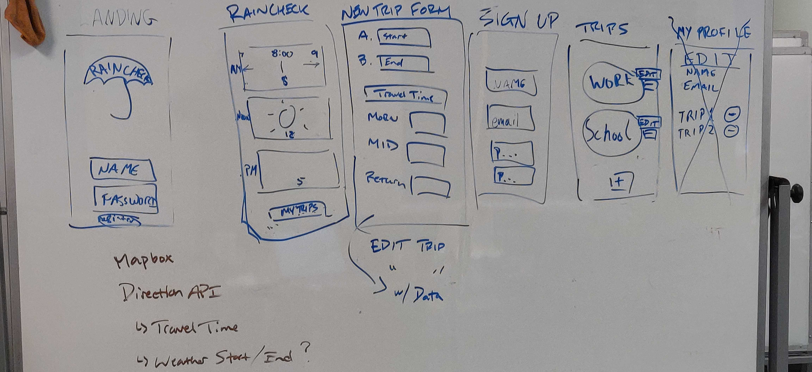
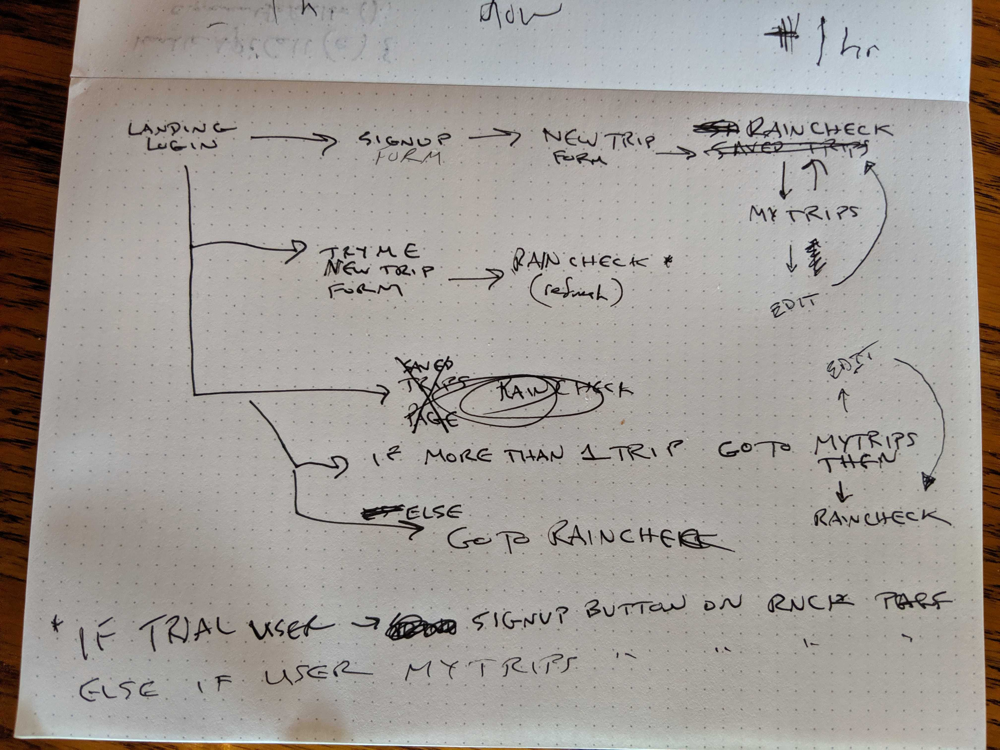
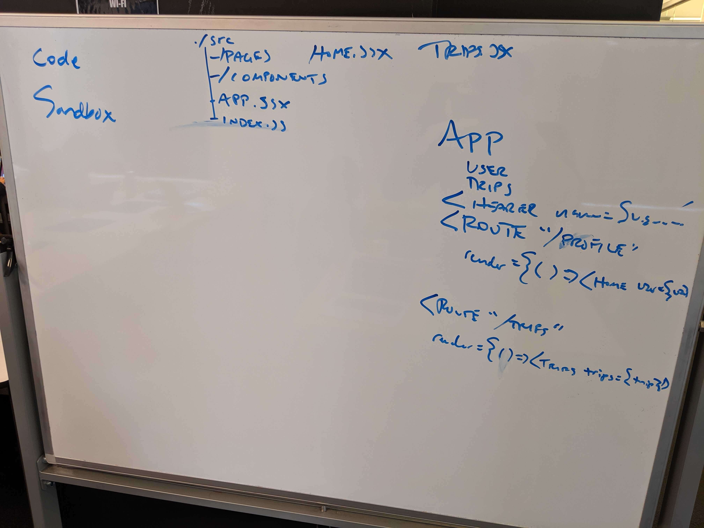
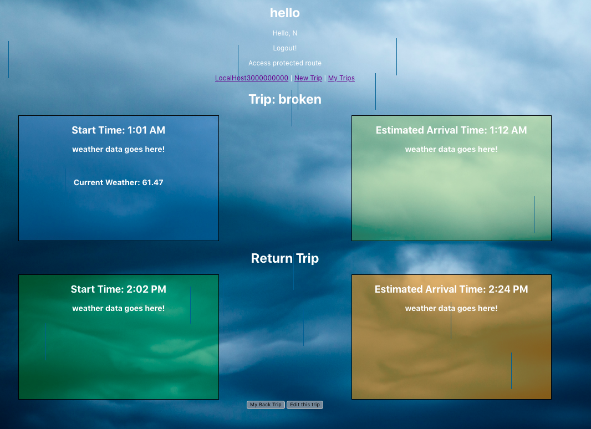

# Raincheck
## Fuad Abdella, Nathan Chan, Adam Grunke | July 26, 2019
### General Assembly - Software Engineering Immersive Project 3: HTML, CSS/Bootstrap, Javascript, Node.js, React.js, MongoDB, Mongoose
#### Check out a demo of the site here: 

# Introduction
Have you ever needed to know what the weather is like at the origin and destination of your route? You have come to the right place. Use Raincheck to save your trips and check the weather at the start and end of each trip. Based on that you'll be able to determine what mode of travel is best or what you might need to wear to take on the day. 

## Project Requirements
This is the third of four projects that will be incorporated as part of the General Assembly Software Engineering Immersive. The goal is to combined all that we have learned in Units 1, 2, and 3 (HTML, CSS, Javasript, Node.js, Express.js, React.js, MongoDB, Mongoose, and Authentication) into a full-stack web application that we can publish for the public. This project requires us to work in a team of three or four developers which also allows us to employ... 

## Technical Requirements
The technical requirements of this project are as follows:
* Build a full-stack application by making your own backend and your own front-end
* Note that if you build an app using Ionic, a backend is optional. However, look into services such as      Firebase if you'd like a service for storing data.
* Have an interactive front-end, preferably using a modern front-end framework
* Be a complete product, which most likely means multiple relationships and CRUD functionality for at least a couple models. However, this is ultimately up to your discretion.
* Use a database, whether that's one we've covered in class or one you want to learn
* Implement thoughtful user stories that are significant enough to help you know which features to build and which to scrap
* Have a visually impressive design to kick your portfolio up a notch and have something to wow future clients & employers
* Be deployed online so it's publicly accessible

# NPM and APIs

Run npm install to install all of the dependencies

## Pulling from APIs

This project combines three APIs with an option to incorporate additional ones: 
1. Dark Sky API - https://darksky.net/dev/docs#overview
2. Mapbox API - https://docs.mapbox.com/api/search/

Images of the API sites

### Dark Sky API:

### Mapbox API:

# Planning
The project team started off by deciding what the user would like to see from this app and then planning how we would layout the frontend and backend portions. We spent approximately 16-20 hours whiteboarding, learning O-Auth, and deciding what approach would be best for this MERN Stack application.

## User Story
The user wants to know if they are going to encounter rain or adverse weather conditions along their commute.

## Whiteboarding
We started this project off by whiteboarding what the app would look like given the user's story. Images of our whiteboarding process are below:

Our goal was to develop a mobile-friendly app for a user to view all of his or her trips and the weather at the origin and destination of the trip. 

## Process
1. We developed the database with a user model and trip model that had a one user to many trips relationship
2. Completed the backend routing for the full-stack app and tested the routes and their interaction with the MongoDB in Postman
3. Tested different React components in Code Sandbox
4. Wrote the different components in React and then linked them in the frontend with React-Router-DOM
5. Connected the frontend with the backend using the Axios node-module
6. Pulled the Dark Sky API data on the backend and served it to the front
7. Styled 

We were troubleshooting different issues throughout this process. See the next section for some of the main challenges. 

Below is an image of what the app currently looks like:

# Challenges
Throughout the development process we ran into a variety of different challenges:
* Having recently learned React.js, structuring and formatting our React app was our greatest challenge as we realized we were storing state in almost every component we created. 
* As we moved throught the project another challenge we faced was deciding as a team on the final product and what the user will end up seeing on the page for each trip. 
* Linking the backend to the frontend was also a great challenge as we tried to determine how to access the different routes in our app. 
* A challenge we faced as a group was trying to split up tasks in a way where everyone can participate
* We ran into a permissions restriction when we tried to call the Dark Sky API from the frontend so we had to call the API from the backend and serve the appropriate data to the front. 
    * A challenge with the weather data comes with trying to query the API for a specific time which will provide the forcasted change of precipitation and temperature at our desired time. 

# Wish List
* Pull the appropriate weather after receiving the data from Dark Sky API 
* Continued styling of the application

# Credit To
Credit to the following people and sources for their insightful help and inspiration:
* Steve Peters
* Mike Shull 
* Carlo Bruno
* Dark Sky API
* Peter Liu: https://blog.mapbox.com/map-the-weather-along-your-route-ae5d6d89e1f4
* Mark Ridgway: https://github.com/MarkRidgway/react-weather

----

## The Following was provided by the node module create-react-app. 

This project was bootstrapped with [Create React App](https://github.com/facebook/create-react-app).

## Available Scripts

In the project directory, you can run:

### `npm start`

Runs the app in the development mode. 
Open [http://localhost:3000](http://localhost:3000) to view it in the browser.

The page will reload if you make edits. 
You will also see any lint errors in the console.

### `npm test`

Launches the test runner in the interactive watch mode. 
See the section about [running tests](https://facebook.github.io/create-react-app/docs/running-tests) for more information.

### `npm run build`

Builds the app for production to the `build` folder. 
It correctly bundles React in production mode and optimizes the build for the best performance.

The build is minified and the filenames include the hashes. 
Your app is ready to be deployed!

See the section about [deployment](https://facebook.github.io/create-react-app/docs/deployment) for more information.

### `npm run eject`

**Note: this is a one-way operation. Once you `eject`, you can’t go back!**

If you aren’t satisfied with the build tool and configuration choices, you can `eject` at any time. This command will remove the single build dependency from your project.

Instead, it will copy all the configuration files and the transitive dependencies (Webpack, Babel, ESLint, etc) right into your project so you have full control over them. All of the commands except `eject` will still work, but they will point to the copied scripts so you can tweak them. At this point you’re on your own.

You don’t have to ever use `eject`. The curated feature set is suitable for small and middle deployments, and you shouldn’t feel obligated to use this feature. However we understand that this tool wouldn’t be useful if you couldn’t customize it when you are ready for it.

## Learn More

You can learn more in the [Create React App documentation](https://facebook.github.io/create-react-app/docs/getting-started).

To learn React, check out the [React documentation](https://reactjs.org/).

### Code Splitting

This section has moved here: https://facebook.github.io/create-react-app/docs/code-splitting

### Analyzing the Bundle Size

This section has moved here: https://facebook.github.io/create-react-app/docs/analyzing-the-bundle-size

### Making a Progressive Web App

This section has moved here: https://facebook.github.io/create-react-app/docs/making-a-progressive-web-app

### Advanced Configuration

This section has moved here: https://facebook.github.io/create-react-app/docs/advanced-configuration

### Deployment

This section has moved here: https://facebook.github.io/create-react-app/docs/deployment

### `npm run build` fails to minify

This section has moved here: https://facebook.github.io/create-react-app/docs/troubleshooting#npm-run-build-fails-to-minify
